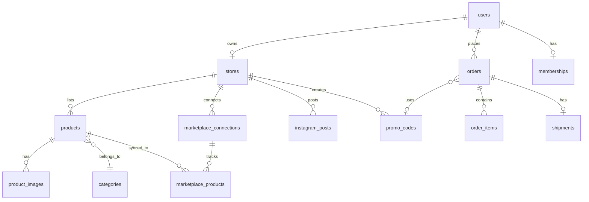

# 03_ERD.md
> Source of truth for all DB tables. Always reference here when writing migrations, queries, or Supabase calls. Do not invent column names.

---

## RUN MIGRATIONS IN THIS ORDER

### 001_users.sql
```sql
create table public.users (
  id         uuid primary key references auth.users(id) on delete cascade,
  role       text not null default 'buyer' check (role in ('buyer','seller','admin')),
  full_name  text,
  avatar_url text,
  created_at timestamptz not null default now(),
  deleted_at timestamptz
);
alter table public.users enable row level security;
create policy "read own" on public.users for select using (auth.uid() = id);
create policy "update own" on public.users for update using (auth.uid() = id);

-- Auto-create on signup
create or replace function public.handle_new_user() returns trigger as $$
begin
  insert into public.users (id, full_name) values (new.id, new.raw_user_meta_data->>'full_name');
  return new;
end;
$$ language plpgsql security definer;
create trigger on_auth_user_created after insert on auth.users
  for each row execute procedure public.handle_new_user();
```

### 002_stores.sql
```sql
create table public.stores (
  id               uuid primary key default gen_random_uuid(),
  user_id          uuid not null references public.users(id) on delete cascade,
  name             text not null,
  slug             text not null unique,
  description      text,
  logo_url         text,
  banner_url       text,
  address          text,
  lat              float8,
  lng              float8,
  google_maps_url  text,
  instagram_handle text,
  status           text not null default 'active' check (status in ('active','inactive','suspended')),
  created_at       timestamptz not null default now(),
  deleted_at       timestamptz
);
alter table public.stores enable row level security;
create policy "public read active" on public.stores for select using (status = 'active' and deleted_at is null);
create policy "seller manage own" on public.stores for all using (auth.uid() = user_id);
create policy "admin all" on public.stores for all using (
  (select role from public.users where id = auth.uid()) = 'admin'
);
```

### 003_categories.sql
```sql
create table public.categories (
  id        uuid primary key default gen_random_uuid(),
  name      text not null,
  slug      text not null unique,
  icon_url  text,
  parent_id uuid references public.categories(id) on delete set null,
  created_at timestamptz not null default now()
);
alter table public.categories enable row level security;
create policy "anyone read" on public.categories for select using (true);
create policy "admin manage" on public.categories for all using (
  (select role from public.users where id = auth.uid()) = 'admin'
);
```

### 004_products.sql
```sql
create table public.products (
  id          uuid primary key default gen_random_uuid(),
  store_id    uuid not null references public.stores(id) on delete cascade,
  category_id uuid references public.categories(id) on delete set null,
  name        text not null,
  description text,
  price       numeric(12,2) not null,
  stock       int not null default 0,
  weight_gram int not null default 0,
  is_featured bool not null default false,
  status      text not null default 'draft' check (status in ('active','draft','archived')),
  created_at  timestamptz not null default now(),
  deleted_at  timestamptz
);
alter table public.products enable row level security;
create policy "public read active" on public.products for select using (status = 'active' and deleted_at is null);
create policy "seller manage own" on public.products for all using (
  exists (select 1 from public.stores where id = store_id and user_id = auth.uid())
);
create policy "admin all" on public.products for all using (
  (select role from public.users where id = auth.uid()) = 'admin'
);
```

### 005_product_images.sql
```sql
create table public.product_images (
  id             uuid primary key default gen_random_uuid(),
  product_id     uuid not null references public.products(id) on delete cascade,
  url            text not null,
  is_primary     bool not null default false,
  is_ai_enhanced bool not null default false,
  sort_order     int not null default 0,
  created_at     timestamptz not null default now()
);
alter table public.product_images enable row level security;
create policy "public read" on public.product_images for select using (true);
create policy "seller manage own" on public.product_images for all using (
  exists (
    select 1 from public.products p
    join public.stores s on s.id = p.store_id
    where p.id = product_id and s.user_id = auth.uid()
  )
);
```

### 006_marketplace_connections.sql
```sql
create table public.marketplace_connections (
  id                uuid primary key default gen_random_uuid(),
  store_id          uuid not null references public.stores(id) on delete cascade,
  platform          text not null check (platform in ('tokopedia','shopee','lazada')),
  access_token_enc  text,
  refresh_token_enc text,
  shop_id           text,
  status            text not null default 'disconnected' check (status in ('connected','disconnected','error')),
  last_sync_at      timestamptz,
  created_at        timestamptz not null default now(),
  unique(store_id, platform)
);
alter table public.marketplace_connections enable row level security;
create policy "seller manage own" on public.marketplace_connections for all using (
  exists (select 1 from public.stores where id = store_id and user_id = auth.uid())
);
```

### 007_marketplace_products.sql
```sql
create table public.marketplace_products (
  id                  uuid primary key default gen_random_uuid(),
  product_id          uuid not null references public.products(id) on delete cascade,
  connection_id       uuid not null references public.marketplace_connections(id) on delete cascade,
  platform_product_id text,
  platform_url        text,
  sync_status         text not null default 'pending' check (sync_status in ('synced','pending','error')),
  last_synced_at      timestamptz,
  created_at          timestamptz not null default now()
);
alter table public.marketplace_products enable row level security;
create policy "seller read own" on public.marketplace_products for select using (
  exists (
    select 1 from public.products p
    join public.stores s on s.id = p.store_id
    where p.id = product_id and s.user_id = auth.uid()
  )
);
```

### 008_promo_codes.sql
```sql
create table public.promo_codes (
  id           uuid primary key default gen_random_uuid(),
  store_id     uuid references public.stores(id) on delete cascade,
  created_by   uuid not null references public.users(id),
  code         text not null unique,
  type         text not null check (type in ('percentage','fixed')),
  value        numeric(10,2) not null,
  min_purchase numeric(12,2) not null default 0,
  max_uses     int,
  used_count   int not null default 0,
  starts_at    timestamptz not null,
  ends_at      timestamptz not null,
  is_active    bool not null default true,
  created_at   timestamptz not null default now()
);
alter table public.promo_codes enable row level security;
create policy "public read valid" on public.promo_codes for select using (
  is_active = true and now() between starts_at and ends_at
);
create policy "creator manage" on public.promo_codes for all using (auth.uid() = created_by);
```

### 009_orders.sql
```sql
create table public.orders (
  id                 uuid primary key default gen_random_uuid(),
  buyer_id           uuid not null references public.users(id),
  store_id           uuid not null references public.stores(id),
  promo_code_id      uuid references public.promo_codes(id),
  status             text not null default 'pending' check (status in ('pending','paid','processing','shipped','delivered','cancelled','refunded')),
  total_amount       numeric(12,2) not null,
  discount_amount    numeric(12,2) not null default 0,
  payment_method     text,
  payment_gateway_id text,
  source             text not null default 'web' check (source in ('web','marketplace')),
  shipping_address   jsonb,
  created_at         timestamptz not null default now()
);
create table public.order_items (
  id         uuid primary key default gen_random_uuid(),
  order_id   uuid not null references public.orders(id) on delete cascade,
  product_id uuid not null references public.products(id),
  quantity   int not null,
  unit_price numeric(12,2) not null,
  subtotal   numeric(12,2) not null,
  created_at timestamptz not null default now()
);
alter table public.orders enable row level security;
alter table public.order_items enable row level security;
create policy "buyer read own" on public.orders for select using (auth.uid() = buyer_id);
create policy "seller read store orders" on public.orders for select using (
  exists (select 1 from public.stores where id = store_id and user_id = auth.uid())
);
create policy "buyer create" on public.orders for insert with check (auth.uid() = buyer_id);
create policy "service update" on public.orders for update using (true);
create policy "participants read items" on public.order_items for select using (
  exists (select 1 from public.orders o where o.id = order_id and (
    o.buyer_id = auth.uid() or
    exists (select 1 from public.stores where id = o.store_id and user_id = auth.uid())
  ))
);
```

### 010_shipments.sql
```sql
create table public.shipments (
  id                  uuid primary key default gen_random_uuid(),
  order_id            uuid not null unique references public.orders(id) on delete cascade,
  courier             text not null,
  tracking_code       text,
  status              text not null default 'pending' check (status in ('pending','picked_up','in_transit','delivered','failed')),
  estimated_delivery  date,
  shipped_at          timestamptz,
  delivered_at        timestamptz,
  kiriminaja_order_id text,
  created_at          timestamptz not null default now()
);
alter table public.shipments enable row level security;
create policy "participants read" on public.shipments for select using (
  exists (select 1 from public.orders o where o.id = order_id and (
    o.buyer_id = auth.uid() or
    exists (select 1 from public.stores where id = o.store_id and user_id = auth.uid())
  ))
);
```

### 011_memberships.sql
```sql
create table public.memberships (
  id           uuid primary key default gen_random_uuid(),
  user_id      uuid not null unique references public.users(id) on delete cascade,
  tier         text not null default 'bronze' check (tier in ('bronze','silver','gold')),
  points       int not null default 0,
  member_since timestamptz not null default now()
);
alter table public.memberships enable row level security;
create policy "read own" on public.memberships for select using (auth.uid() = user_id);
```

### 012_instagram_posts.sql
```sql
create table public.instagram_posts (
  id           uuid primary key default gen_random_uuid(),
  store_id     uuid not null references public.stores(id) on delete cascade,
  product_id   uuid references public.products(id) on delete set null,
  caption      text,
  image_url    text,
  ig_post_id   text,
  status       text not null default 'draft' check (status in ('draft','published','failed')),
  scheduled_at timestamptz,
  published_at timestamptz,
  created_at   timestamptz not null default now()
);
alter table public.instagram_posts enable row level security;
create policy "seller manage own" on public.instagram_posts for all using (
  exists (select 1 from public.stores where id = store_id and user_id = auth.uid())
);
```

### 013_ai_sessions.sql
```sql
create table public.ai_sessions (
  id         uuid primary key default gen_random_uuid(),
  user_id    uuid not null references public.users(id) on delete cascade,
  messages   jsonb not null default '[]',
  created_at timestamptz not null default now(),
  updated_at timestamptz not null default now()
);
alter table public.ai_sessions enable row level security;
create policy "manage own" on public.ai_sessions for all using (auth.uid() = user_id);
```

---

## RELATIONSHIPS

```
users      1──1  stores
users      1──N  orders (buyer)
users      1──1  memberships
stores     1──N  products
stores     1──N  marketplace_connections (one per platform)
stores     1──N  promo_codes
stores     1──N  instagram_posts
products   1──N  product_images
products   N──1  categories
products   1──N  marketplace_products
marketplace_connections 1──N marketplace_products
orders     1──N  order_items
orders     1──1  shipments
orders     N──1  promo_codes (nullable)
```

---

## MERMAID


